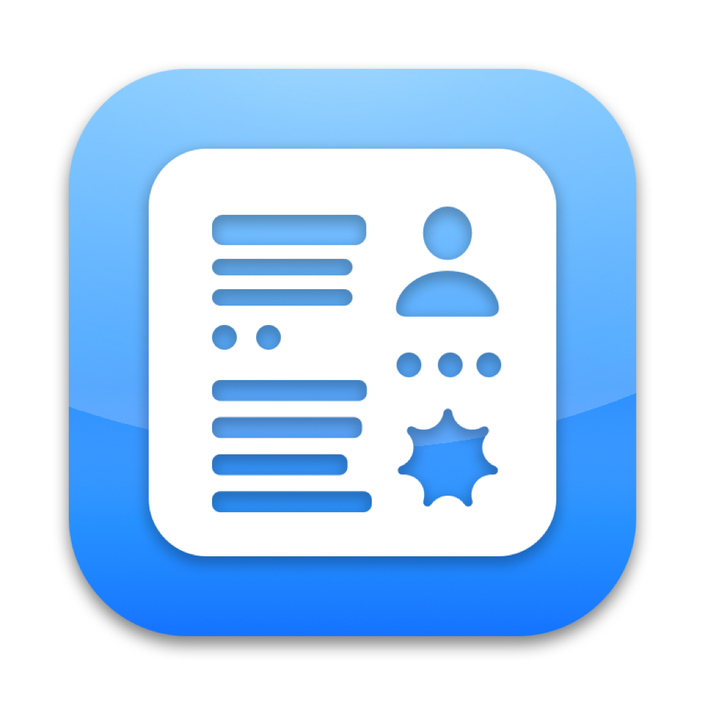

[English](./README.md)

	 
	 
	
	<h1>简历制作工具</h1>

使用我们的可视化编辑器，您可以轻松定制您的简历，以满足您的个人求职需求和风格偏好。

## Screenshots

	
	
	
	

 

## 专为 Mac 打造

作为一款原生 Mac 应用程序，Resumake 可为您提供该平台所能提供的最佳用户体验。

## 隐私第一

Mac 不会泄露任何信息，也无需登录。