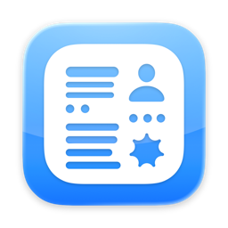
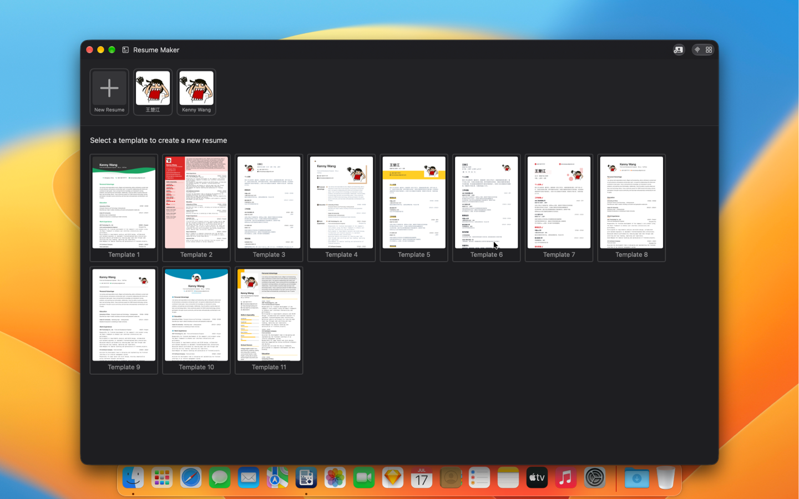
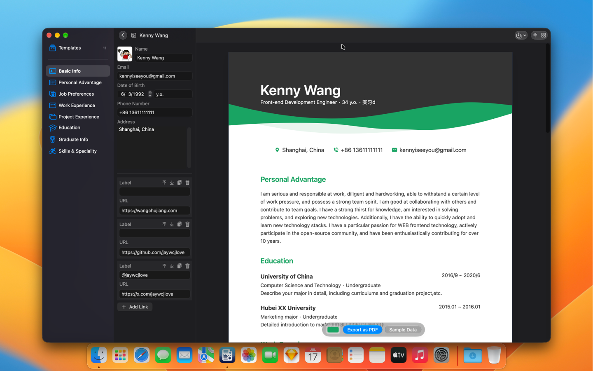
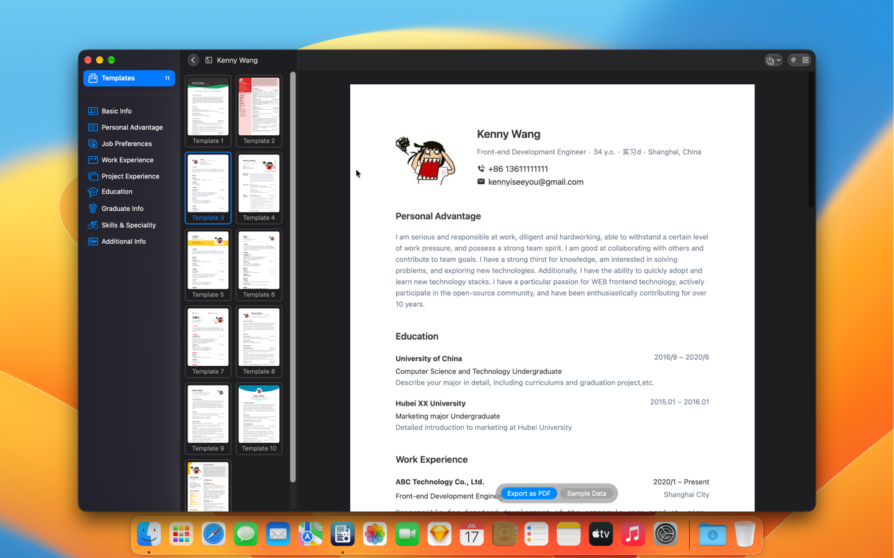
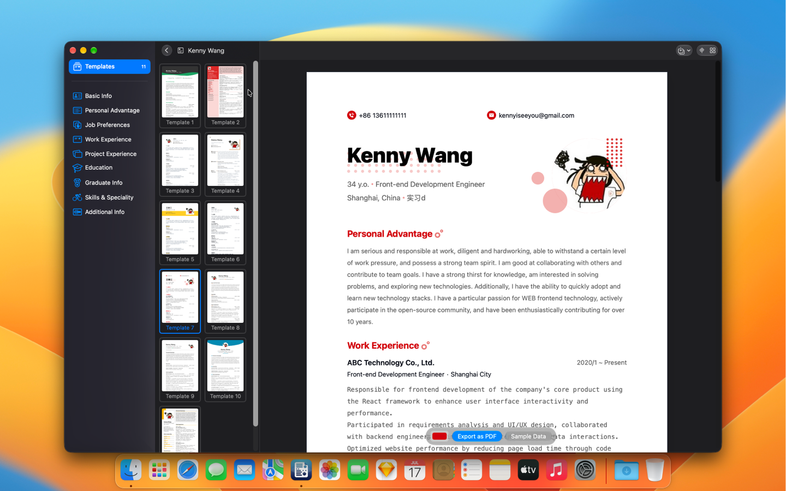

   
   
  
  <h1>简历制作工具</h1>
  <!--rehype:style=border: 0;-->
  

    <a href="./README.md">English</a> • 
    <a target="_blank" href="https://github.com/jaywcjlove/focus-cursor/issues/new?template=bug_report_cn.yml">联系&支持</a> • 
    <a href="./CHANGELOG.zh.md">更新日志</a>
  

  

    
  

使用我们的可视化编辑器，您可以轻松定制您的简历，以满足您的个人求职需求和风格偏好。

## Screenshots

## 专为 Mac 打造

作为一款原生 Mac 应用程序，Resumake 可为您提供该平台所能提供的最佳用户体验。

## 隐私第一

Mac 不会泄露任何信息，也无需登录。
