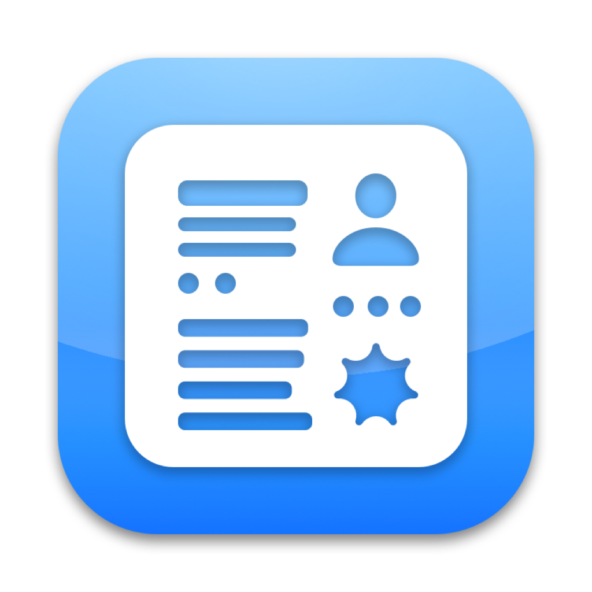
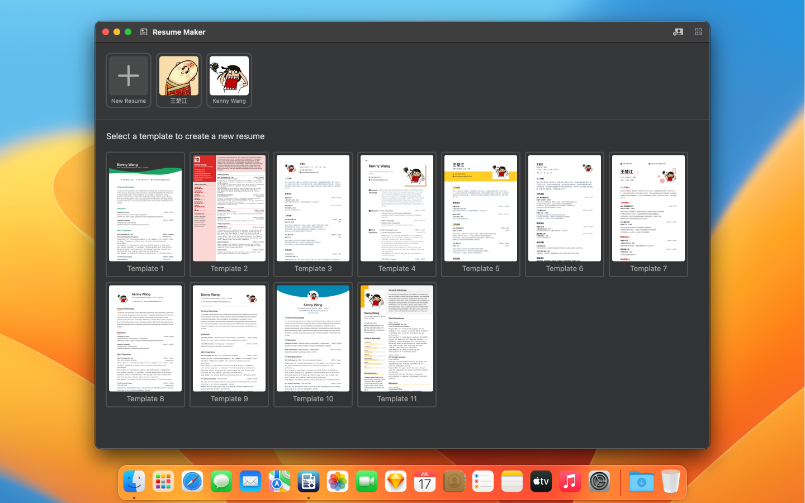
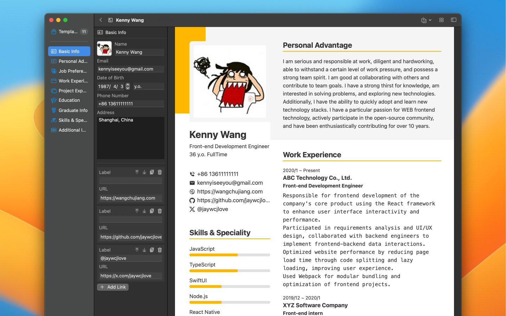
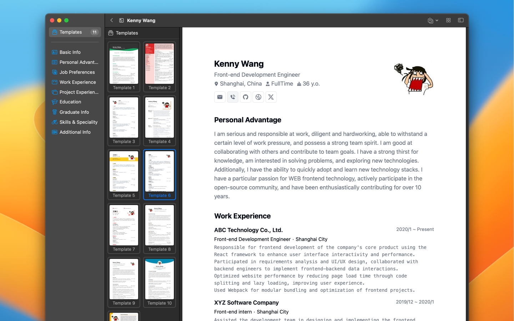
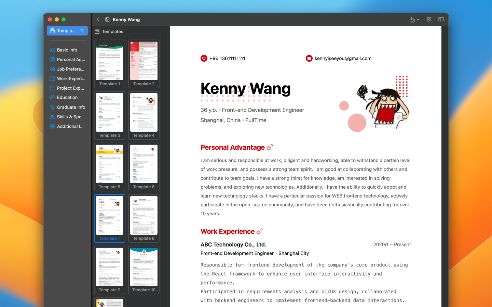

[中文](./README-zh.md)

	 
	 
	
	<h1>Resume Revise</h1>

With our visual editor, you can easily customize your resume to fit your individual job hunting needs and stylistic preferences.

## Screenshots

	
	
	
	

 

## Built for Mac

As a native Mac app, Resumake offers you the best user experience the platform has to offer.

## Privacy First

No information leaves your Mac. No logins are required either.
